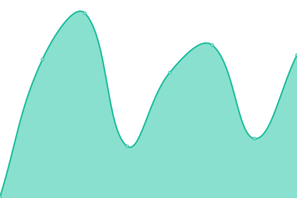
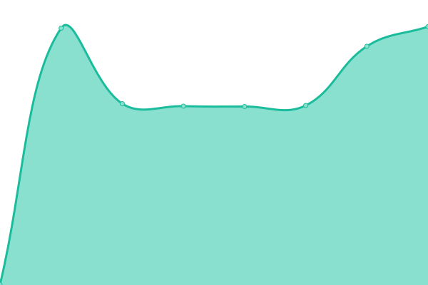
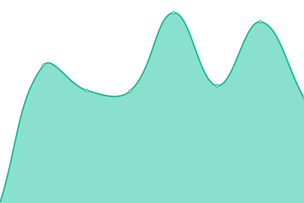

# [📈 Live Status](https://renggli.github.io/upptime): <!--live status--> **🟧 Partial outage**

This repository contains the open-source uptime monitor and status page for [Lukas Renggli](http://www.lukas-renggli.ch), powered by [Upptime](https://github.com/upptime/upptime).

With [Upptime](https://upptime.js.org), you can get your own unlimited and free uptime monitor and status page, powered entirely by a GitHub repository. We use [Issues](https://github.com/renggli/upptime/issues) as incident reports, [Actions](https://github.com/renggli/upptime/actions) as uptime monitors, and [Pages](https://renggli.github.io/upptime) for the status page.

<!--start: status pages-->
<!-- This summary is generated by Upptime (https://github.com/upptime/upptime) -->
<!-- Do not edit this manually, your changes will be overwritten -->
<!-- prettier-ignore -->
| URL | Status | History | Response Time | Uptime |
| --- | ------ | ------- | ------------- | ------ |
|  [Lukas Renggli](https://www.lukas-renggli.ch) | 🟥 Down | [lukas-renggli.yml](https://github.com/renggli/upptime/commits/HEAD/history/lukas-renggli.yml) | 

 1131ms
     
 | 

<a href="https://renggli.github.io/upptime/history/lukas-renggli">100.00%</a>
    

|  [PetitParser](https://petitparser.github.io/) | 🟩 Up | [petit-parser.yml](https://github.com/renggli/upptime/commits/HEAD/history/petit-parser.yml) | 

 76ms
     
 | 

<a href="https://renggli.github.io/upptime/history/petit-parser">100.00%</a>
    

|  [TextLint](https://textlint.lukas-renggli.ch) | 🟥 Down | [text-lint.yml](https://github.com/renggli/upptime/commits/HEAD/history/text-lint.yml) | 

 3223ms
     
 | 

<a href="https://renggli.github.io/upptime/history/text-lint">100.00%</a>
    

|  [Smalltalk Code](https://source.lukas-renggli.ch) | 🟥 Down | [smalltalk-code.yml](https://github.com/renggli/upptime/commits/HEAD/history/smalltalk-code.yml) | 

 4256ms
     
 | 

<a href="https://renggli.github.io/upptime/history/smalltalk-code">100.00%</a>
    

<!--end: status pages-->

[**Visit our status website →**](https://renggli.github.io/upptime)

## 📄 License

- Powered by: [Upptime](https://github.com/upptime/upptime)
- Code: [MIT](./LICENSE) © [Lukas Renggli](http://www.lukas-renggli.ch)
- Data in the `./history` directory: [Open Database License](https://opendatacommons.org/licenses/odbl/1-0/)
